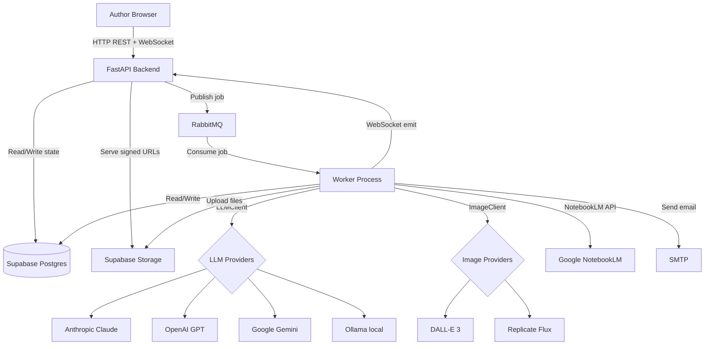
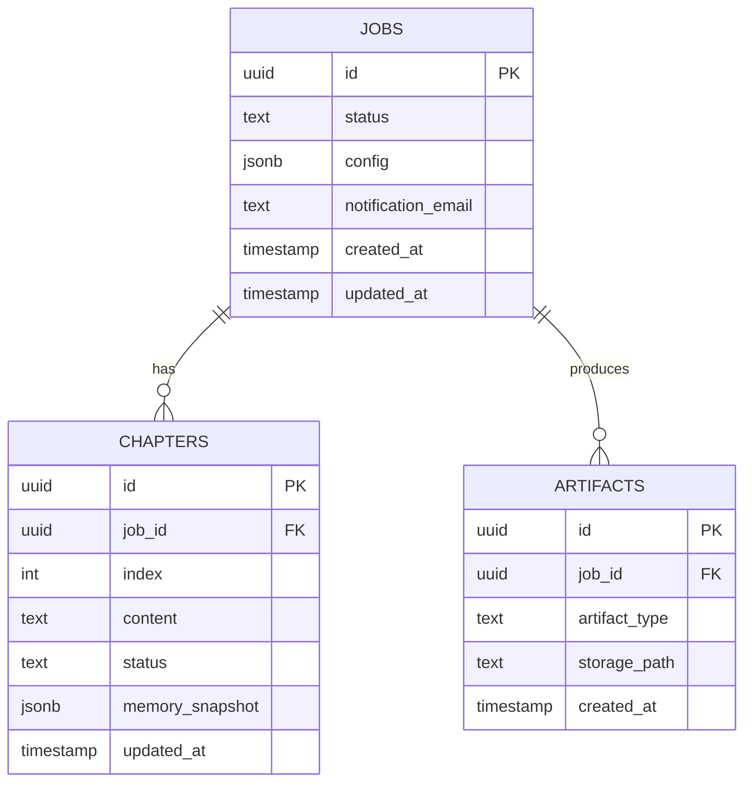

# Design: Book Generation Engine

## Overview

The Book Generation Engine is a modular monolith in Python that automates end-to-end book generation and produces Amazon KDP-ready bundles. A FastAPI backend exposes REST + WebSocket endpoints. A separate worker process consumes RabbitMQ jobs and executes the engine pipeline. Supabase provides Postgres state management and file storage. A React/Next.js dashboard provides the author-facing UI.

---

## Architecture



---

## Components and Interfaces

### Core Abstractions

```python
class LLMClient:
    def __init__(self, provider: str, model: str, api_key: str, base_url: str | None = None): ...
    def complete(self, prompt: str, system_prompt: str = "") -> str: ...
    async def acomplete(self, prompt: str, system_prompt: str = "") -> str: ...

class ImageClient:
    def __init__(self, provider: str, api_key: str): ...
    def generate(self, prompt: str, width: int = 1024, height: int = 1536) -> bytes: ...

class MemoryStore:
    def __init__(self, job_id: str, mode: Literal["fiction", "non_fiction"]): ...
    def update(self, key: str, value: Any) -> None: ...
    def get(self, key: str) -> Any: ...
    def snapshot(self) -> dict: ...
```

### Engine Base

```python
class BaseEngine:
    name: str
    def __init__(self, llm: LLMClient, memory: MemoryStore, job_config: JobConfig): ...
    def run(self, context: dict) -> dict: ...  # returns updated context
```

### FastAPI App Structure

```
app/
  main.py                 — FastAPI app, router mounts, lifespan
  api/
    jobs.py               — POST /jobs, GET /jobs/{id}, WebSocket /ws/{job_id}
    chapters.py           — GET /jobs/{id}/chapters, PUT /chapters/{id}, POST /chapters/{id}/regenerate
    export.py             — GET /jobs/{id}/export
  models/
    job.py                — JobCreate, JobResponse, JobStatus Pydantic models
    chapter.py            — Chapter, ChapterUpdate models
  services/
    job_service.py        — create_job(), get_job(), update_job_status()
    chapter_service.py    — save_chapter(), lock_chapter(), regenerate_chapter()
    email_service.py      — send_completion_email()
    storage_service.py    — upload_file(), get_signed_url()
  queue/
    publisher.py          — publish_job(job_id, config)
    connection.py         — RabbitMQ connection pool
  ws/
    manager.py            — WebSocket connection manager, broadcast()

worker/
  main.py                 — Worker entrypoint, consumes from RabbitMQ
  pipeline/
    runner.py             — Orchestrates the full engine pipeline
    shared_core.py        — Entry Gate, Intent, Audience, Positioning, Blueprint Selector
    fiction_path.py       — F1–F7 engines
    non_fiction_path.py   — N1–N5 engines + NotebookLM research
    generation.py         — Chapter Generator, Continuity, QA, Style Enforcer
    assembly.py           — Final Assembly, Packaging, Cover, Formatting
  clients/
    llm_client.py         — LLMClient with all providers
    image_client.py       — ImageClient (DALL-E, Replicate)
    notebooklm_client.py  — NotebookLM API wrapper
  memory/
    store.py              — MemoryStore (fiction + non-fiction variants)
```

---

## Data Models

See Database Architecture section for full schema. Key entities:

- **Job** — id, status, config (JSONB), created_at, updated_at
- **Chapter** — id, job_id, index, content, status (locked|pending|qa_failed), memory_snapshot
- **Artifact** — id, job_id, type (epub|pdf|cover|brief|description|metadata), storage_path
- **ProgressEvent** — emitted via WebSocket (not persisted)

---

## API Design

### REST Endpoints

```
POST   /v1/jobs                        — Create job, publish to queue
GET    /v1/jobs/{job_id}               — Get job status + config
GET    /v1/jobs/{job_id}/chapters      — List chapters with status
PUT    /v1/chapters/{chapter_id}       — Update chapter content (inline edit)
POST   /v1/chapters/{chapter_id}/lock  — Lock chapter
POST   /v1/chapters/{chapter_id}/regenerate — Trigger chapter regeneration
GET    /v1/jobs/{job_id}/export        — Get signed download URL for KDP bundle
```

### WebSocket

```
WS /v1/ws/{job_id}
Server emits: { type: "progress", job_id, chapter_index, total_chapters, step, status }
Server emits: { type: "chapter_ready", job_id, chapter_id, chapter_index }
Server emits: { type: "complete", job_id, download_url }
Server emits: { type: "error", job_id, message }
```

---

## Error Handling Strategy

- All FastAPI endpoints return `{ "error": "message" }` on 4xx/5xx.
- Workers catch per-engine exceptions, update job status, and emit a WebSocket error event.
- `ProviderRateLimitError` triggers exponential backoff (0.5s, 1s, 2s) with max 3 retries.
- `UnsupportedProviderError` raised at client construction — fast fail, no retries.
- Chapter QA failures allow 2 regeneration retries; after that chapter status = `qa_failed`, job paused.

---

## Database Architecture

### Technology Choice

**ADR-001: Supabase (Postgres) as primary datastore**
- Status: Accepted
- Context: Need relational state management + file storage + row-level security in a single managed service. Supabase provides Postgres, object storage, and a Python SDK.
- Decision: Use Supabase for all state and file storage.
- Consequences: No separate file server; signed URLs for downloads. RLS policies needed for multi-author support.

### Schema / ERD



### Migration Strategy

Supabase migrations via `supabase db push`. Each migration is a numbered SQL file in `supabase/migrations/`. Zero-downtime: additive changes only per migration. Rollbacks via a complementary `down` migration file.

### Indexing & Query Patterns

- `chapters(job_id, index)` — composite index for chapter list queries
- `jobs(status)` — partial index for worker polling (status != 'complete')
- `artifacts(job_id, artifact_type)` — composite index for export queries

### Partitioning / Sharding

Not applicable at initial scale. Chapters table may partition by `created_at` if > 10M rows.

---

## Deployment & Infrastructure

### Cloud Services

Local dev: Docker Compose (RabbitMQ, Supabase local). Production: Supabase cloud + Railway/Render for FastAPI + worker containers.

### Environment Config

```
ANTHROPIC_API_KEY, OPENAI_API_KEY, GOOGLE_API_KEY, OLLAMA_BASE_URL
REPLICATE_API_TOKEN, OPENAI_IMAGE_API_KEY
RABBITMQ_URL
SUPABASE_URL, SUPABASE_SERVICE_ROLE_KEY, SUPABASE_ANON_KEY
SMTP_HOST, SMTP_PORT, SMTP_USER, SMTP_PASSWORD, FROM_EMAIL
SECRET_KEY, DEBUG
```

### CI/CD Pipeline

GitHub Actions: lint (ruff) → type-check (mypy) → unit tests (pytest) → build Docker image → push to registry → deploy FastAPI + worker.

### Rollback Strategy

Docker image tagging by git SHA. Roll back by redeploying previous image tag.

---

## Observability

### Instrumentation Points

- Job lifecycle: created, queued, planning, generating, assembling, complete, failed
- Chapter lifecycle: pending, generating, locked, qa_failed
- LLM call: provider, model, prompt_tokens, completion_tokens, latency_ms
- WebSocket connections: connected, disconnected, error

### SLO / SLI Definitions

- Job completion within 30 minutes for a 12-chapter book (p95)
- API response time < 500ms (p95, excludes streaming)

### Alerting Rules

- Job stuck in `generating` > 45 minutes → PagerDuty warning
- LLM provider error rate > 5% over 5 minutes → PagerDuty critical
- Worker queue depth > 50 → PagerDuty warning

---

## Testing Strategy

### Test Pyramid

- **Unit (70%):** All engine logic, LLMClient routing, MemoryStore, Pydantic models
- **Integration (25%):** FastAPI endpoints with Supabase test DB, RabbitMQ test container
- **E2E (5%):** Full job submission to completion with a stub LLM provider

### Unit Tests

Framework: pytest + pytest-asyncio. Coverage target: 80%. Mock all LLM and Supabase calls.

### Integration Tests

Use `testcontainers` for RabbitMQ. Use Supabase local for Postgres. Run in CI.

### Performance Tests

k6 load test: 10 concurrent job submissions, p95 API < 500ms.

---

## Security Architecture

### Threat Model

| Threat | Vector | Likelihood | Impact | Mitigation |
|--------|--------|------------|--------|------------|
| API key leakage | JSONB job config in DB | High | High | Encrypt config JSONB field at rest; never log config |
| SSRF via Ollama base_url | User-supplied URL | Medium | High | Allowlist validation on base_url |
| Unauthorized job access | No auth on GET /jobs | Medium | Medium | Require bearer token; RLS in Supabase |
| Prompt injection | User title/topic as prompt | Medium | Medium | Sanitise user strings before prompt interpolation |

### Auth & Authz

Bearer token (Supabase JWT) for all API endpoints. Row-level security on jobs/chapters tables scoped to user_id.

### Secrets Management

All secrets via environment variables. Never logged, never included in error responses, never stored in job config JSONB in plaintext — provider API keys in config encrypted with AES-256 using `SECRET_KEY`.

### Input Validation

Pydantic v2 models at FastAPI boundary. String length limits on title (500 chars), topic (2000 chars). Allowlist validation for provider names and model names.

---

## Scalability and Performance

- Worker is stateless — scale horizontally by running N worker containers against the same RabbitMQ queue.
- FastAPI is stateless — scale behind a load balancer.
- Supabase Postgres is the bottleneck — use connection pooling (PgBouncer via Supabase).
- LLM calls are the dominant latency source — emit progress events to keep the UI responsive.
- Target: 10 concurrent book generation jobs without degradation.

---

## Dependencies and Risks

| Dependency | Risk | Mitigation |
|---|---|---|
| Anthropic API availability | LLM call failures | Retry with backoff; fallback to OpenAI if configured |
| NotebookLM API stability | Non-fiction research failures | Graceful fallback to LLM synthesis |
| Supabase storage limits | Large EPUB/PDF files | Compress artifacts; set max book size |
| RabbitMQ durability | Job loss on broker restart | Durable queues + persistent messages |

---

## UI/UX Design

### User Flows

**Flow 1 — Submit Job:**
1. Author visits `/` → sees Job Creator form
2. Fills in all fields → clicks Submit
3. System validates → navigates to `/jobs/{id}` Book Editor
4. Progress bar appears; pipeline begins

**Flow 2 — Monitor & Edit:**
1. Author sees chapter list; chapters appear as they are locked
2. Author clicks chapter → inline editor opens
3. Author edits → saves on blur
4. Author clicks Regenerate → loading spinner → updated content appears
5. Author clicks Lock → chapter greys out, locked badge shown

**Flow 3 — Export:**
1. Job status badge shows "Complete"
2. Author clicks Export tab
3. Sees file list preview + "Download KDP Bundle" button
4. Clicks button → browser downloads zip via signed URL

### Screen / Component Inventory

| Screen/Component | Purpose |
|---|---|
| JobCreatorForm | Full form for job parameters |
| ProviderConfigPanel | Nested panel: LLM + image provider dropdowns, model, API key |
| BookEditorView | Container for chapter list + progress |
| ChapterCard | Displays chapter content, status badge, edit/regenerate/lock actions |
| InlineEditor | Contenteditable div with save-on-blur |
| ProgressBar | Shows pipeline step name + percentage |
| ExportView | File list + download button |
| StatusBadge | Colour-coded job/chapter status |

### Design Tokens

- Primary: `#1a1a2e` (dark navy)
- Accent: `#e94560` (red)
- Background: `#16213e`
- Surface: `#0f3460`
- Text: `#eaeaea`
- Success: `#22c55e`
- Warning: `#f59e0b`
- Error: `#ef4444`
- Font: Inter (sans-serif), JetBrains Mono (code)
- Border radius: 8px
- Spacing scale: 4px base

### Responsive Behaviour

- Mobile (<640px): Single-column layout; chapter cards stack vertically
- Tablet (640–1024px): Two-column: chapter list left, editor right
- Desktop (>1024px): Three-column: nav, chapter list, editor + memory panel
